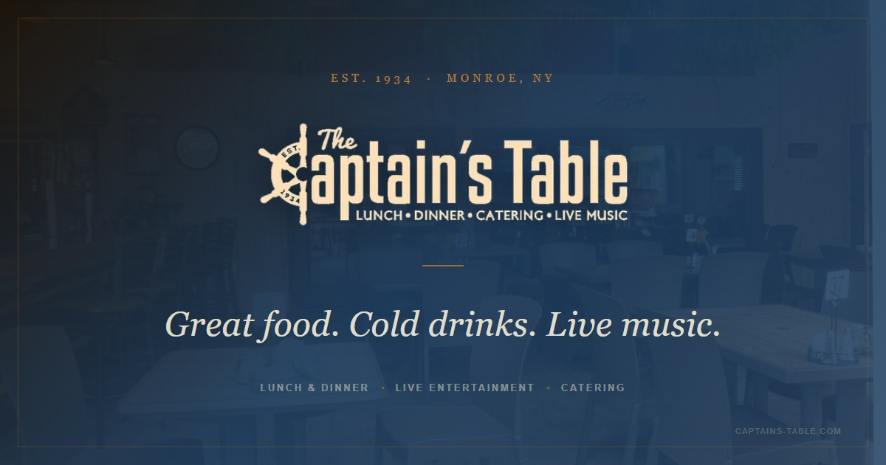

# The Captain's Table

**[Live Site →](https://captainstable.netlify.app/)**

Website for The Captain's Table — a bar and restaurant in Monroe, NY, serving since 1934. American food, live music, and cold drinks on Route 17M in the Hudson Valley.

## Stack

HTML5 · CSS3 (no JS) · Playfair Display + Karla (Google Fonts)

## Pages

| File | Description |
|------|-------------|
| `index.html` | Homepage |
| `menu.html` | Food and drink menu |
| `catering.html` | Catering services |
| `events.html` | Events and live music |
| `gift-cards.html` | Gift cards |
| `contact.html` | Contact and hours |
| `brand-identity.html` | Brand style guide |

## Running it

No build step — open `index.html` in a browser.

## CSS architecture

Shared styles (tokens, reset, nav, footer, animations, schedule rows) live in
`styles.css`. Each page has a small inline `<style>` block for page-specific
overrides only.

Color palette uses CSS custom properties: dark navy, cream, and amber as the
core three. Typography is Playfair Display (headings, display text) + Karla (UI
and body text).

## Notable details

- `index.html` has no JavaScript — all interactions are CSS-only
- Hero section uses a slow Ken Burns zoom (`heroZoom` keyframe) with a
  `prefers-reduced-motion` fallback
- A diagonal clip-path cut separates the hero from the content below
- Schema.org JSON-LD is set up with full restaurant data (address, hours,
  cuisine type, social links) for search engine visibility
- Google site verification file included (`google4590794af7a0f44c.html`)
